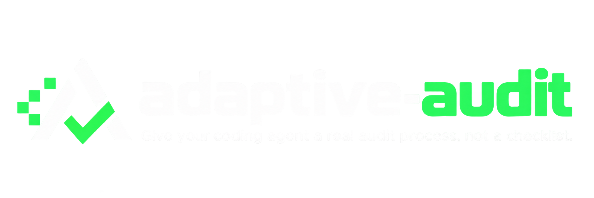
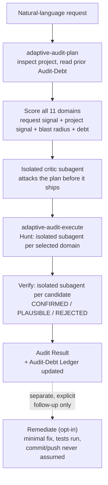

<p align="center">
  
</p>

<p align="center">
  Domain-agnostic scoping · Isolated Hunt → Verify · Cross-run Audit-Debt tracking<br>
  Claude Code Skills
</p>

<p align="center">
  <a href="https://github.com/kajisho5/adaptive-audit/actions/workflows/test.yml"></a>
  <a href="https://github.com/kajisho5/adaptive-audit/actions/workflows/codeql.yml"></a>
  <a href="LICENSE"></a>
  
</p>

```
/plugin marketplace add kajisho5/adaptive-audit
/plugin install adaptive-audit@adaptive-audit
```

`adaptive-audit` is two [Claude Code Skills](https://docs.anthropic.com/en/docs/agents-and-tools/agent-skills) — `adaptive-audit-plan` and `adaptive-audit-execute` — that turn "check this for bugs" / "バグチェックして" into a real, complete audit instead of a fixed checklist or a single generic pass. Given a plain request, the agent inspects the actual project (stack, architecture, risk signals, recent changes), scores all 11 audit domains against what it actually found — not just what the request happened to name — runs an isolated Hunt pass per selected domain, then a separate isolated Verify pass that independently checks every candidate before it's reported. One natural-language request, a real answer, no required follow-up question.

> **Audit-Debt Ledger.** Every plan and every execution is recorded outside the
> project (`~/.adaptive-audit/`), so a domain that keeps getting skipped across
> differently-framed requests — this week "look at security" ("セキュリティ見て"),
> next month "look at performance" ("パフォーマンス見て") — shows up as
> accumulating debt even when the current
> request never mentions it. Coverage tracked across audit *types*, not just
> repeated runs of the same one. → [full explanation](#the-audit-debt-ledger)

---

**Contents**
[Why](#why) · [Quick start](#quick-start) · [How it works](#how-it-works) · [Design principles](#design-principles) · [Audit domains](#audit-domains) · [The Audit-Debt Ledger](#the-audit-debt-ledger) · [Remediate](#remediate-opt-in) · [Invariant Extraction](#invariant-extraction-opt-in-public-beta) · [How this compares](#how-this-compares-to-existing-tools) · [Validated so far](#validated-so-far) · [Install](#install) · [Cost](#cost) · [Development](#development) · [Docs](#docs)

---

## Why

Most "review my code" tools run the same fixed checklist — usually security-only, or a generic style/lint pass — no matter what the project actually is or what the person actually asked. That wastes effort on domains that don't matter here and silently skips ones that do, with no record of the decision ever having been made:

- **The request is a hint, not a ceiling.** "check this for bugs" on a payment webhook handler gets `security` and `data-integrity` scored and selected even though neither was named — a blast-radius floor for auth/payment/PII signals, not just keyword matching (`adaptive-audit-plan/SKILL.md` step 3).
- **Scope decisions are never silent.** Every excluded domain gets a stated reason in the plan; a domain that scored high on project signals but wasn't selected says so explicitly, not just via omission.
- **The plan gets attacked before it ships.** An isolated critic subagent argues against the plan itself — a mismatched depth, an exclusion that doesn't hold up, a signal that maps to no domain — before any Hunt pass runs.
- **A hunter that expects to find things will find things.** Hunt and Verify run as separate, isolated subagents; Verify sees only the candidate's claim and the source, never the hunter's confidence or reasoning.
- **Debt doesn't reset when the request changes framing.** A domain skipped five times in a row because every request happened to be framed around something else is exactly the gap this project tracks.

## Quick start

```
/plugin marketplace add kajisho5/adaptive-audit
/plugin install adaptive-audit@adaptive-audit
```

Then just talk to your agent, in any language:

> "check this for bugs" / "バグチェックして"

The agent inspects the project, scores all 11 domains, runs `adaptive-audit-plan`'s self-critique, then `adaptive-audit-execute`'s isolated Hunt → Verify per selected domain — and reports back CONFIRMED / PLAUSIBLE findings with file:line evidence, in one response, translated into whatever language you asked in. No slash command needed; asking for it in plain language is the whole interface.

Want the plan without running it? Ask for that instead:

> "what should we look at, don't actually check yet" / "何を確認すべきか教えて、まだ実行しないで"

Found something you want fixed? Ask separately, after the findings exist:

> "fix the confirmed findings" / "直して"

This runs the opt-in **Remediate** step (see [below](#remediate-opt-in)) — never assumed from a request's severity, always a second, explicit ask.

## How it works



## Design principles

1. **The request is a starting signal, not the whole picture.** The project's own code — auth code, payment code, a migrations folder — is often a better guide to what needs checking than the words someone used to ask for it.
2. **Never audit without scoping first, even under time pressure.** `adaptive-audit-execute` always runs `adaptive-audit-plan`'s process before Hunt/Verify — skipping the plan and going straight to findings is the two-step, generic-checklist failure mode this project exists to avoid.
3. **Isolation is what makes Verify mean anything.** A Verify subagent that saw the Hunter's reasoning would anchor on confirming it. When true subagent isolation isn't available in a given environment, the skill says so plainly in its output rather than silently reporting a same-session fallback as if it were isolated.
4. **Never write to the audited project, with exactly two disclosed, opt-in exceptions.** Saving the findings report into the project (only on explicit request), and Remediate's fixes (only on a separate, explicit follow-up). Neither is ever inferred from severity, urgency, or who looks like they own the repo.
5. **Count what actually happened, not what was planned.** A domain that was supposed to run Deep but only completed a Quick-equivalent pass before running out of budget is recorded as executed-at-Quick — the Audit-Debt Ledger is only meaningful if it reflects real work, not attempted work.
6. **Depth is per-domain, not uniform.** A project can warrant Deep on `security` and Quick on `performance` in the same run; a `depth_confidence: provisional` domain (a generic-baseline call, not a specific signal) gets a cheaper staged Quick-then-escalate treatment instead of a full Standard/Deep pass by default.
7. **Fixing is never assumed from finding.** A report full of high-severity CONFIRMED findings is still just a report until a separate, later, explicit request asks for it to be acted on.

## Audit domains

Fixed set of 11 (`adaptive-audit-plan/references/audit-domains.md`) — kept stable across runs so the Audit-Debt Ledger stays comparable over time; a project that genuinely needs something outside this list gets a caveat in the plan, not an ad-hoc 12th domain.

| Domain | What it checks for | Depth range |
|---|---|---|
| `security` | Auth/session/token handling, payment/PII, deserialization, raw SQL, subprocess/exec/eval, crypto, public endpoints | Quick: pattern scan · Standard: trace one attack path per class · Deep: safe reproduction, dependency CVEs |
| `correctness` | Logic errors, off-by-one, null/undefined handling, edge cases against intended behavior | Quick: obvious errors in changed code · Standard: trace business-logic paths · Deep: enumerate edge cases per function |
| `performance` | N+1 patterns, blocking calls in a request path, large in-memory structures, hot paths | Quick: anti-pattern scan · Standard: algorithmic complexity of hot paths · Deep: candidate benchmarks, run if possible |
| `reliability` | Missing timeout/retry on external calls, unhandled panics, dead-letter/retry gaps | Quick: error handling exists at all · Standard: trace failure propagation · Deep: partial-failure and retry-storm scenarios |
| `architecture` | God-files/functions, circular imports, unclear module boundaries, duplicated logic | Quick: obvious violations · Standard: map actual vs. intended dependency graph · Deep: propose a concrete restructuring |
| `data-integrity` | Missing validation before persistence, multi-step writes without transactions, denormalized data | Quick: validation at persistence boundaries · Standard: trace multi-step writes · Deep: migration reversibility, partial-application behavior |
| `concurrency` | Shared mutable state across goroutines/threads/async tasks, lock ordering | Quick: flag shared mutable state · Standard: trace lock usage for races/deadlocks · Deep: reason about interleavings, run a race detector |
| `dependency-health` | Stale lockfiles, unpinned versions, packages with frequent CVEs, vendored code | Quick: list ancient pinned versions · Standard: cross-reference known CVEs · Deep: transitive tree, license, vendoring integrity |
| `configuration-deployment` | Hardcoded secrets, unsafe config defaults, CI/CD and IaC definitions | Quick: no plaintext secrets · Standard: safe defaults under misconfiguration · Deep: trace the deploy pipeline for a single point of failure |
| `test-coverage` | High-risk modules with no test file, tests that only exercise the happy path | Quick: does the riskiest code have any test · Standard: do tests exercise failure/edge paths · Deep: which untested branches matter most, and why |
| `observability` | Reliability-flagged code with no log/metric on failure, no way to confirm success | Quick: failure paths emit at least a log line · Standard: critical operations have a success signal · Deep: what an on-call person would actually need |

Every domain scored high on project signals or blast radius but *not* selected still gets a stated reason in the plan output — never silently dropped.

## The Audit-Debt Ledger

Modeled on the `Artifact`/`ProductionReceipt` pattern from [`kajisho5/AI-video-production-OS`](https://github.com/kajisho5/AI-video-production-OS)'s `docs/SPEC.md`: one content-addressed record per completed run, kept outside the audited project (`~/.adaptive-audit/projects/<fingerprint>/{receipts,results}/`), never touching the target repo's own git status.

- **Plan receipts** record what was decided — selected/excluded, depth, reasoning — written by `adaptive-audit-plan`.
- **Execution results** record what was *actually* Hunted and Verified, linked back to the plan they executed — written by `adaptive-audit-execute`. A domain only counts toward reduced debt once it has a real execution result, not merely a plan intent.
- `scripts/receipts.py debt` (or the human-readable `report`, or `export-csv` for a spreadsheet) computes, per domain: how many times selected vs. excluded, the deepest it's ever been verified, and how many runs since it was last verified at Deep. A domain unverified across many runs — or repeatedly excluded regardless of how each request happened to be framed — surfaces as **UNAUDITED**, **PLANNED-ONLY**, **STALE**, or **AGING**, disclosed even when the current request never mentions that domain.
- The STALE/AGING thresholds (3 and 2 runs) are a disclosed heuristic, not a calibrated constant — see the comment directly above `_debt_status()` in `receipts.py` for the reasoning and for how to change them if your own audit cadence doesn't fit.
- A **diff-scoped re-audit** (`adaptive-audit-plan` step 0.5) is offered — never decided silently — only when a prior full audit exists and the change since is clearly small (≤15% of tracked files, ≤20 files). It shows which domains carry real debt a diff-only pass won't touch, and tracks itself separately (`diff_checks_since_last_full`) so it's never mistaken for full re-verification.

## Remediate (opt-in)

A plain audit request never fixes anything — no matter how severe the findings. Only a **separate, explicit follow-up** ("fix this" / "直して", "fix this and open a PR" / "直してPRにして") triggers `adaptive-audit-execute` step 6:

- Defaults to every CONFIRMED finding when none are named; a PLAUSIBLE finding is never fixed without being asked about first.
- Checks, and states plainly *before* touching any file, whether this session can actually write to the project and — only if a PR/push was requested — whether it can push to or open a PR against that destination. A requested end-state already known to be impossible (no remote configured, no push credential) never retroactively authorizes a lesser, unrequested action like committing locally.
- Fixes minimally, one finding at a time, scoped to exactly the finding's own failure scenario. Adds or extends a test — and, critically, verifies that test actually has the power to catch the bug (fails against the *original* code first, via the ecosystem's race detector for concurrency findings, a structural assertion for performance ones) rather than trusting a single after-the-fix pass.
- Never commits or pushes without being asked to; states exactly which of {fix written, tested, committed, pushed, PR opened} happened.
- Never touches the Audit-Debt Ledger — fixing a finding isn't the same claim as re-verifying its domain.

**This step is explicitly not a differentiator.** Anthropic's own `/security-review` and Snyk's official Claude Skill already do scan-then-fix (the latter with an optional PR step); what Remediate adds is only that it stays inert until asked, and never conflates "fixed" with "re-verified."

## Invariant Extraction (opt-in, public beta)

The single most novel and least-validated idea from the original research (`adaptive-audit-execute/references/invariant-extraction.md`): instead of hunting domain-by-domain, extract 5-10 plain-English invariants purely from the code's own structure *before* looking for violations, then check each one independently.

Validated across four trials so far — repeatedly rediscovering a prior audit's most severe findings via a completely different reasoning path, and twice finding real issues the domain-based pipeline had missed. Every one of those trials, though, was run by this project's own author using this project's own verification methodology — not independent evidence. **[Issue #12](https://github.com/kajisho5/adaptive-audit/issues/12) is an open call for third-party trial reports** on your own projects, positive or negative — exactly the evidence needed before this could reasonably move past opt-in status.

## How this compares to existing tools

Stated plainly, not just linked from a research doc: **if your need is security-only, an existing tool likely already covers most of this pipeline, and this project doesn't claim otherwise.**

| Project | Type | Overlap | This project's own status by comparison |
|---|---|---|---|
| [`cloudflare/security-audit-skill`](https://github.com/cloudflare/security-audit-skill) | Claude Skill | Same Hunt → adversarial Verify → independent-check pattern, security-specific | No comparable real-world track record — this project's own validation is 3 redacted full-domain audits, see [Validated so far](#validated-so-far) |
| [`dinosn/raptor-loop-hunt`](https://github.com/dinosn/raptor-loop-hunt) | Claude Skill | Same pattern, plus a persistent coverage ledger, security-specific | Reports 200+ verified findings across 40+ real codebases — a scale this project has not run at |

What this project adds, as far as a competitive search could confirm (absence of a match is reported as "not found," never as "doesn't exist" — see `research/adaptive-audit-competitive-research.md` for the full method): treating "what to audit" as **domain-agnostic** rather than security-specific, and **tracking audit debt across audit types**, not just repeated runs of the same one. The opt-in Remediate step is explicitly *not* part of that differentiation — see [above](#remediate-opt-in).

## Validated so far

| Result | What was tested |
|---|---|
| 4 domains, 0 domain-selection mismatches | Iteration 1: skill-applied vs. baseline plans across 4 fixtures, including one adversarial case (a hardcoded payment API key outside the requested scope) the baseline missed entirely and the skill caught via the blast-radius floor |
| 3 real, unfamiliar third-party projects | Full multi-domain Standard/Deep audits — 1.7M / 1.53M / 1.05M tokens respectively (see [Cost](#cost)); findings redacted, see `evals/validation-notes.md` |
| 4 invariant-extraction trials, 0 false positives (n too small for a rate) | Independently rediscovered prior audits' most severe findings via a different reasoning path; twice found real issues domain-based Hunt had missed, including on a ~20,571-line C codebase |
| 4 Remediate trials across Python / Go / Node | Performance, concurrency, and SQL-injection bug classes; push-possible and push-impossible destinations; single- and multi-finding requests — every fix independently verified via an A/B check against the original bug, not asserted from reading the diff |

Full narrative for all of the above, including every judgment call and its reasoning, in `evals/validation-notes.md`.

## Install

**As a plugin** (recommended — gives an installed copy a real update path):
```
/plugin marketplace add kajisho5/adaptive-audit
/plugin install adaptive-audit@adaptive-audit
```
Later, to pull in whatever's newest on `main`:
```
/plugin marketplace update adaptive-audit
```
This is a personal/third-party marketplace, not an official Anthropic one, so Claude Code's background auto-update is off by default for it — the command above is the manual pull, or enable it per-marketplace via `/plugin` → Marketplaces → `adaptive-audit` → Enable auto-update. Skill auto-invocation ("check this for bugs" / "バグチェックして", no slash command) works identically either way.

**Plain copy** (no update mechanism — re-copy by hand for the latest): copy `adaptive-audit-plan/` and `adaptive-audit-execute/` into `.claude/skills/`.

## Cost

**Running this consumes your own Claude Code usage/API budget.** No shared backend, no mechanism for cost to land on anyone but whoever typed the request.

| Language / shape | Size | Domains | Tokens |
|---|---|---|---|
| Python CLI tool | ~8,300 lines | 7 | ~1.7M |
| C/C++ network-facing library | ~20,600 lines | 7 | ~1.53M |
| TypeScript/Node web app | ~10,900 lines | 6 | ~1.05M |

(Project names withheld deliberately — see `evals/validation-notes.md`.) A Quick-only pass or a plan-only request costs a small fraction of this — depth drives cost, not project size alone. Say so explicitly ("take a quick look" / "さっと見て", "give it a light check" / "軽くチェックして") if cost matters more than thoroughness for a given ask; the plan step reads that as a depth signal.

## Development

```
python3 -m pytest tests/ -v      # scripts/receipts.py + scripts/bump_version.py — the only deterministic, non-LLM logic here
python3 <skill-dir>/scripts/receipts.py report --project-root <path>   # human-readable Audit-Debt table
```

`SKILL.md`'s actual LLM-driven behavior can't be unit-tested — it's checked by running a real agent against `evals/fixtures/` and recording what happened in `evals/validation-notes.md`. A change to either `SKILL.md` that alters behavior should come with a new validation-notes.md entry, not just updated prose. See `CONTRIBUTING.md` for the full workflow.

**Repository automation** (not the skills' own behavior): `.github/workflows/release.yml` runs on every push to `main` — resolves the next version from merged-PR labels via `release-drafter`, respects a manual `VERSION` bump instead of overwriting it, updates `VERSION`/`CHANGELOG.md`/`marketplace.json`, tags, and creates the GitHub Release, all in one job. `autolabel.yml` applies the labels that resolution reads. `codeql.yml` scans this repo's own Python source, deliberately excluding `evals/fixtures/**`'s frozen, sometimes-deliberately-vulnerable synthetic test corpora — `dependabot.yml` excludes the same paths for the same reason.

## Docs

| | |
|---|---|
| [CONTRIBUTING.md](CONTRIBUTING.md) | repo layout, testing (both the pytest suite and the eval methodology), how to add a new `SKILL.md` step |
| [SECURITY.md](SECURITY.md) | how to report a vulnerability in this repo's own code privately |
| [`adaptive-audit-plan/SKILL.md`](adaptive-audit-plan/SKILL.md) | the scoping process the planning skill follows |
| [`adaptive-audit-execute/SKILL.md`](adaptive-audit-execute/SKILL.md) | Hunt → Verify → Remediate, step by step |
| [`adaptive-audit-plan/references/audit-domains.md`](adaptive-audit-plan/references/audit-domains.md) | the fixed 11-domain taxonomy in full |
| [`adaptive-audit-execute/references/invariant-extraction.md`](adaptive-audit-execute/references/invariant-extraction.md) | the opt-in invariant-extraction technique, all four trials in full |
| [`research/adaptive-audit-competitive-research.md`](research/adaptive-audit-competitive-research.md) | the pre-implementation competitive analysis, feature matrix, naming investigation |
| [`evals/validation-notes.md`](evals/validation-notes.md) | every validation run, iteration by iteration, judgment calls included |
| [CHANGELOG.md](CHANGELOG.md) | what changed in each release |

## License

[MIT](LICENSE)
